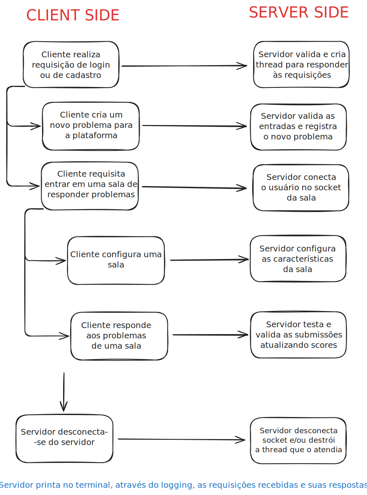

# README - Sistema de Logging Thread-Safe em C++ (Versão Entrega 1)


## Diagrama


## Descrição Fase 1

Esta fase contém uma implementação de uma classe de logging em C++ que:
- Permite imprimir mensagens coloridas no terminal.
- Garante que mensagens de diferentes threads sejam exibidas na ordem correta utilizando um ticket lock.
- Fornece funções específicas para diferentes níveis de log: log, error, success, warning e info.
- É totalmente thread-safe, adequado para aplicações multithreaded.

## Arquivos

`logging.hpp`
- Contém a definição da classe Logging.
- Implementa cores ANSI para o terminal através do namespace Colors.
- Métodos disponíveis:
    - `log(const std::string& msg, const char* color = Colors::RESET)` → Mensagem genérica colorida.
    - `error(const std::string& msg)` → Mensagem de erro (vermelho).
    - `success(const std::string& msg)` → Mensagem de sucesso (verde).
    - `warning(const std::string& msg)` → Mensagem de aviso (amarelo).
    - `info(const std::string& msg)` → Mensagem informativa (ciano).

`main.cpp`
- Demonstra o uso da classe Logging em um cenário multithreaded.
- Cria um número definido de threads (qtd_threads), cada uma escolhendo aleatoriamente um método de log para imprimir.
- Utiliza pthread_barrier_t para sincronizar a inicialização das threads.
- Cada thread imprime sua mensagem utilizando o ticket lock da classe Logging para garantir ordem correta no terminal.

## Compilação

Para compilar o projeto, utilize o g++ com suporte a C++11 ou superior:

```bash
g++ main.cpp -o main -pthread
```

## Execução

Após compilar, execute o programa:

```bash
./main
```

Você verá mensagens coloridas impressas no terminal, cada thread utilizando uma função de log aleatória. As mensagens serão exibidas na ordem de chegada ao logger, graças ao ticket lock implementado.

## Notas

- A implementação utiliza POSIX threads (pthread) e é compatível com sistemas Linux/Unix.
- O ticket lock garante FIFO na impressão de mensagens, evitando que prints de múltiplas threads se misturem.
- O sistema de cores utiliza códigos ANSI, compatíveis com a maioria dos terminais modernos.
- As funções de log error, success, warning e info adicionam um prefixo colorido às mensagens, enquanto o método genérico log permite cores customizadas.

## Exemplo de saída

```bash
Thread 1 inicializada, esperando na barreira...
Thread 2 inicializada, esperando na barreira...
Thread 3 inicializada, esperando na barreira...

Iniciando o teste da biblioteca Logging criada

[ERROR] Thread 1 testando e finalizando...
[SUCCESS] Thread 2 testando e finalizando...
[INFO] Thread 3 testando e finalizando...
===== FINALIZADO =====
```

## Licença

Projeto de estudo e demonstração para aprendizado de Programação Concorrente e Distribuída. Uso livre para fins educacionais.