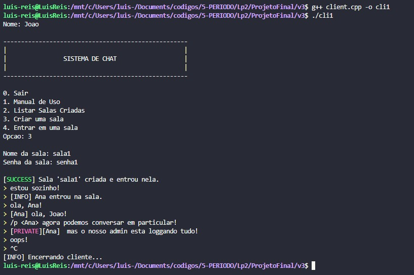
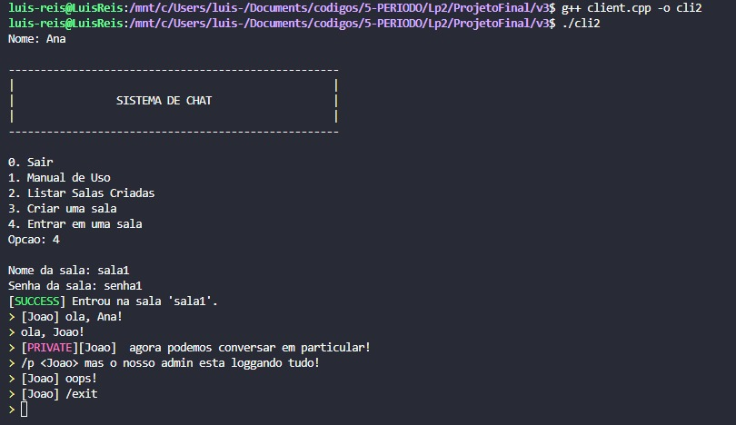
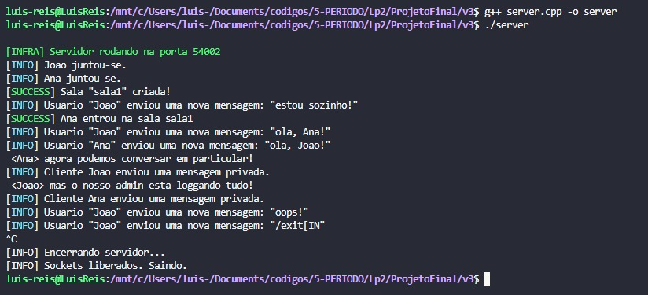

# Sistema de Chat em Rede (C++ com Sockets)

Este projeto implementa um **sistema de chat multi-salas** utilizando **C++ e sockets nativos**, sem bibliotecas externas de rede.
A aplicação é dividida em dois programas principais:

* **Servidor**: gerencia conexões, salas, autenticação e mensagens.
* **Cliente**: interface em terminal que permite ao usuário interagir em tempo real.
---

## Diagrama atualizado


---

## 🚀 Funcionalidades

### Servidor

* Inicia na porta padrão **54002**.
* Gerencia múltiplos clientes de forma concorrente utilizando threads.
* Permite criar salas protegidas por senha e listar todas as salas ativas.
* Remove automaticamente salas vazias.
* Oferece suporte a mensagens privadas com o comando:

  ```
  /p <nome1,nome2,...> mensagem
  ```
* Responde a comandos de controle:

  * `/user <nome>`: define o nome do cliente.
  * `/create <sala> <senha>`: cria uma sala nova.
  * `/join <sala> <senha>`: entra em uma sala existente.
  * `/list`: lista todas as salas criadas.
  * `/exit`: desconecta o cliente do servidor.

### Cliente

* Exibe um **menu interativo** em terminal com opções:

  * Listar salas criadas.
  * Criar uma nova sala.
  * Entrar em uma sala existente.
* Mostra as mensagens recebidas em tempo real em paralelo ao input do usuário.
* Envia mensagens normais, privadas e comandos.
* Finaliza corretamente com:

  * Comando `exit`
  * Atalho **Ctrl+C** (capturado via `signal`)

---

## 🛠️ Como executar

### Compilação

No Linux/WSL, compile com:

```bash
g++ server.cpp -o server -pthread
g++ client.cpp -o client -pthread
```

### Execução

1. **Inicie o servidor**:

   ```bash
   ./server
   ```

2. **Abra um ou mais clientes** em terminais diferentes:

   ```bash
   ./client
   ```

3. Informe **nome de usuário** e escolha no menu entre:

   * Listar salas (`/list`)
   * Criar sala (`/create`)
   * Entrar em sala (`/join`)

4. Dentro da sala:

   * Envie mensagens para todos.
   * Use `/p` para mensagens privadas.
   * Digite `exit` ou pressione **Ctrl+C** para sair.

### Usando o Makefile

1. Para usar o makefile, simplesmente navegue para a versão mais atual e chame o seguinte comando:
```bash
  make
```

---

## 📋 Exemplo de uso

### Servidor

```
[INFRA] Servidor rodando na porta 54002
[SUCCESS] Sala "sala1" criada!
[INFO] Joao entrou na sala sala1
[INFO] Ana entrou na sala sala1
[PRIVATE][Joao] oi Ana, tudo bem?
[INFO] Ana saiu da sala.
```

### Cliente

```
----------------------------------------------------
|                SISTEMA DE CHAT                   |
----------------------------------------------------

0. Sair
1. Manual de Uso
2. Listar Salas Criadas
3. Criar uma sala
4. Entrar em uma sala

Nome: Joao
Nome da sala: sala1
Senha da sala: 123

[SUCCESS] Entrou na sala 'sala1'.
> oi pessoal!
```

---

## 📸 Demonstração

Abaixo, serão adicionados **três prints** mostrando uma mesma conversa:

### 📷 **POV do Joao**


### 📷 **POV da Ana**


### 📷 **POV do Admin (servidor)**



---

## 📦 Estrutura de Arquivos

```
.
├── server.cpp      # Código-fonte do servidor
├── client.cpp      # Código-fonte do cliente
├── logging.hpp     # Biblioteca de logging colorido e thread-safe
└── README.md       # Este documento
```

---

## 📌 Observações

* O sistema utiliza **sockets TCP (AF_INET, SOCK_STREAM)**.
* O servidor suporta múltiplos clientes simultâneos via **threads**.
* Logs são coloridos para fácil depuração.
* Testado em **Linux/WSL**. Pode exigir ajustes em Windows nativo.
